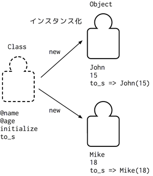

### 6.1 オブジェクトとクラス定義

Rubyに存在する値はすべてオブジェクトである。
オブジェクトは状態(フィールド)と振る舞い(メソッド)を持つ。
オブジェクトを作るには、オブジェクトの型を定義するためクラスを利用する。
簡単なクラスの例を以下に示す。

```ruby
class Human
  def initialize(name, age)
    @name = name
    @age = age
  end

  def to_s
    "#{@name}(#{@age})"
  end
end

Human.new('John', 15)
=> John(15)
Human.new('Mike', 18)
=> Mike(18)
```

クラスの中には関数を書くことができ、これを*メソッド*と呼ぶ。
メソッドの基本的な書き方は、2節で書いた関数の書き方と一緒である。
上の例では、*initialize*と*to_s*の２つのメソッドが定義されているが、これはどちらも特殊な意味を持つメソッドである。クラスからオブジェクト生成するには*new*というキーワードを使う必要がある。*new*キーワードを使ってオブジェクトを生成することを「インスタンス化」と呼ぶ。
この「インスタンス化」時に、呼び出されるメソッドが*initialize*メソッドである。
*initialize*の定義は自由だが、基本的にはオブジェクトを構成するための初期値の代入処理を書くことが一般的である。また、*initialize*メソッドのことをコンストラクタと呼ぶことがある。
オブジェクトはそれぞれに固有の状態を持っており、この状態を*フィールド*と呼ぶ。
フィールドは変数の一種で、@(アットマーク)を名前の先頭に付けることで宣言でき、どのメソッドでも同じ参照を指す。上の例では、コンストラクタで*@name*と*@age*２つのフィールドが引数name, ageで初期化され、*to_s*メソッドで参照されている。
*to_s*メソッドは、オブジェクトを標準出力などで表現するときの文字列を定義するメソッドである。
*puts*メソッドなどでオブジェクトを出力すると*to_s*を明記しなくても、暗黙的に呼びだされていることが確認できる( puts Human.new('John', 15) )。
以上が簡単なクラス定義とオブジェクト生成の流れだが、最初はとても複雑に見えるので以下に図で表す。



以下にクラスの定義を示す。

```ruby
class クラス名
  メソッド...
end
```

クラスの中にはメソッドを列挙するが、上の定義では式の列挙になっている。
メソッド以外の式を記述するとどのような挙動を示すか試してみると良いだろう。

演習:

名前を表す(ミドルネームも考慮せよ)クラス*Name*を定義し、自然に出力されるように*to_s*を定義せよ。また、クラス*Human*の*name*をクラス*Name*のインスタンスを使用せよ。

```ruby
Name.new('Barack', 'Obama')
=> "B.O."
Name.new('George', 'W', 'Bush')
=> "G.W.B."
Human.new('Barack', 'Obama', 54)
=> "B.O. (54)"
Human.new('George', 'W', 'Bush', 69)
=> "G.W.B. (69)"
```

上の例のようにあるオブジェクト(クラス)があるオブジェクト(クラス)を持っている関係をHAS-Aの関係と呼ぶ(Human has a Name.)。
オブジェクトについてまとめると、

- クラスを元にオブジェクトは作られる
- オブジェクトは状態(フィールド)と振る舞い(メソッド)を持つ
- コンストラクタ(initialize)でオブジェクトの初期化が行われる

となる。
オブジェクト指向をすることで、構造を使い回すことができる(Humanクラスの定義に従って、いくつもインスタンスを作ることができる)という利点を得ることができた。この利点を*reusability*(再利用性)と呼びオブジェクト指向を使う重要なメリットである。また細かい部品を組み合わせる(HumanとName)ことにより、部品単位で修正などができるので小回りが効くなどの利点も持っている。
