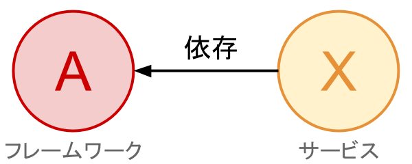

## 8.1 RubyGemsの概要と使い方

**RubyGems**とは、Rubyの**パッケージマネージャ**のことである。パッケージマネージャは世界中のプログラマが投稿したパッケージ(ライブラリやフレームワーク)をローカルな環境で利用することを支援するツールのことで、パッケージのインストールや削除、また**依存関係の解決**を行う。

依存関係とは、ある、パッケージを含む様々なプログラムを利用する際に、そのプログラム以外にも必要なプログラムがある状態のことを言う。例えば以下の図のような状態のことである。



この図では、AというフレームワークをXというサービスで利用しているので依存関係が発生している。このとき、**XはAに依存している**という。この図だけ見ると、AをインストールすればXは実行可能になるように見える。では次の図を見てみよう。


実はAもBという別のライブラリに依存していたとする。この場合、AをインストールするにはBが必要になるので、XはAとBの二つのパッケージをインストールしなければならない。この例は極めて単純な例なので手動でも解決できるかもしれないが、Aが他にも依存関係を持っていたり、Bがさらに別のライブラリCに依存していたりなど、複雑になってくると自分の手で解決するのは困難である。パッケージマネージャはこの依存関係の解決を自動で行ってくれるのだ。具体的には、Aというパッケージをインストールするときに、依存するBという他のパッケージも同時にインストールしてくれるので、Aの利用者はBを意識的にインストールする必要はなくなる。

---

では、実際にRubyGemsを使ってパッケージを使ったプログラムを書いてみよう。

まず、RubyGems利用するためにはgemコマンドを環境にインストールしなければならない。OSごとのパッケージマネージャからインストールするか、[RubyGemsのソースコード](https://rubygems.org/pages/download)を直接ビルドしてインストールすると良い。これ以降はgemコマンドが使える状態という前提で説明していく。

gemコマンドを利用してgemをインストールする時には以下のコマンドを実行する。

```
gem install [gem名]
```

では実際にTitleizeというライブラリをインストールして利用してみよう。
Titleizeとは文字列を単語ごとに区切ってそれぞれの頭文字を大文字に変換する、titleizeメソッドを提供するgemライブラリである。

```
gem install titleize
```

次に、インストールしたパッケージを使ってプログラムを書いてみる。

```ruby
require 'titalize'

puts 'this is the lecture text of ruby for SCCP2016'
#=>   this is the lecture text of ruby for SCCP2016

puts 'this is the lecture text of ruby for SCCP2016'.titleize
#=>   This Is the Lecture Text of Ruby for SCCP2016
```

requireはC言語での#includeの役割をするが、Rubyのrequireは構文ではなくメソッドである。

ただし、このページで説明したgemコマンドは学校の環境では使えないので、個人で使っているパソコンにインストールして使ってみよう。
